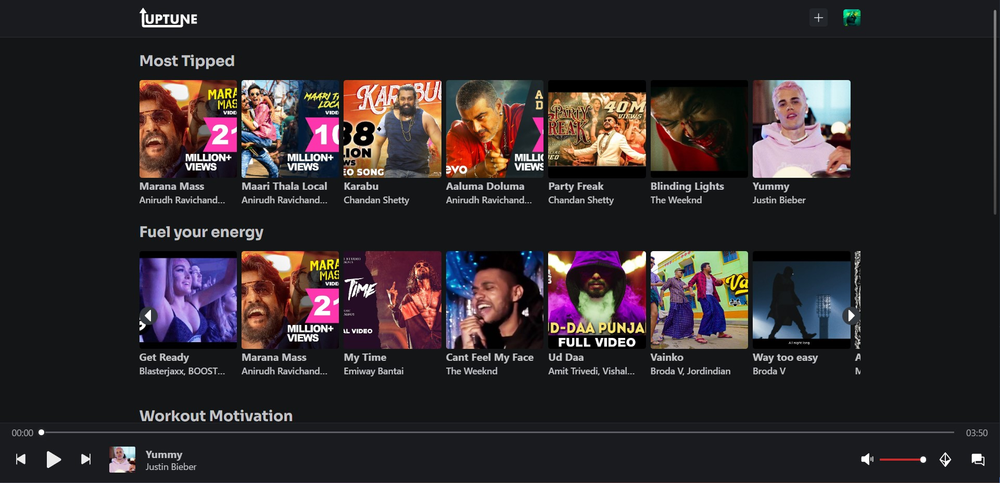
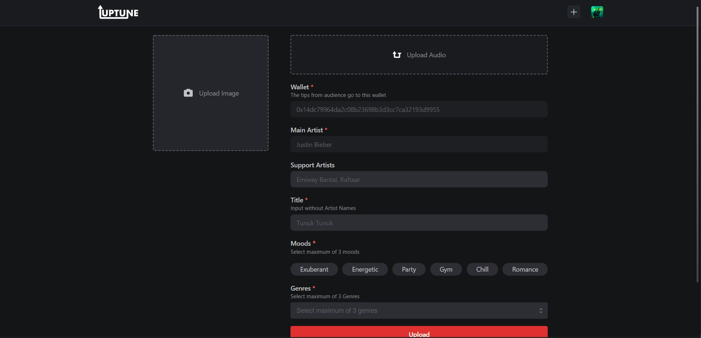
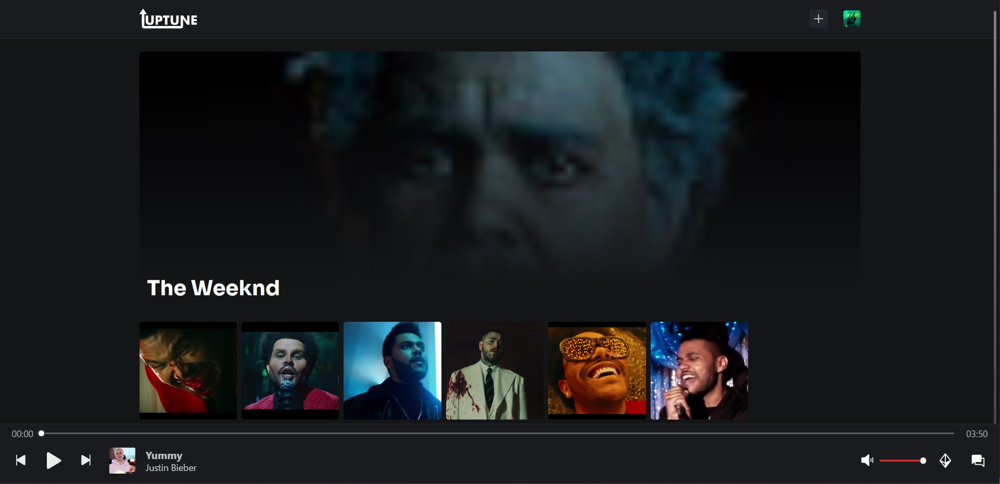

<div align="center">
 
</div>

# Uptune

Looking for a new, decentralised music streaming app? Look no further than **Uptune**! With Uptune, you can upload your own music and listen to it whenever you want, without having to worry about centralised servers. Plus, you can be sure that your music is always available, even if the app goes down – because there is no centralised server, there is no single point of failure.



## Description

This app is made to understand how IPFS works and how it can be used to make a DAPP(Decentralized Application). It makes use of Web3.Storage for IPFS and hardhat's local test network for the testing. The app allows users to create an artist and upload music to it. It gets stored on the blockchain and can get recommended on the home page. The users can get paid by their audience who can tip them and also send in messages.

## Features

- The app would allow users to upload and share their music with others on the network

- The app would be decentralized, meaning that there would be no central server or authority

- The app would use blockchain technology to ensure the security and integrity of the network

- The app would be open source, meaning that anyone would be able to contribute to its development

- People can tip the artists using the inbuilt payment options




                                     
## Getting Started

### Dependencies

* [React.js](https://reactjs.org/) - v18.0.0
* [Mantine](https://mantine.dev/) - v4.2.2
* [Web3.storage](https://web3.storage/) - v4.2.0
* [Swiper](https://swiperjs.com/) - v8.1.4

 ### Dev Dependancies
 
 * [hardhat](https://hardhat.org/) - v2.9.3
 * [ethers](https://docs.ethers.io/v5/) - v5.6.5

### Installing

- Install the MetaMask extension on your browser

- Install all the dependancies using npm or yarn
```
  npm i
```

### Executing program

1. Create 2 terminals
2. Run this command to start the Ethereum Test Network 
```
  $ npx hardhat node
```
3. Run this command to deploy the Smart Contract on the blockchain 
```
  $ npx hardhat run scripts/deploy.js --network localhost
```
4. Start the frontend application 
```
  $ npm run dev
```
